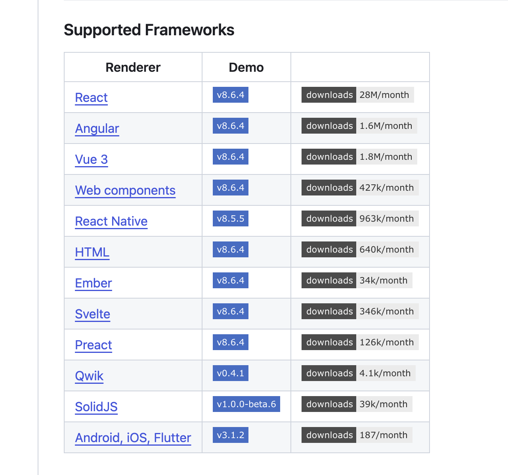
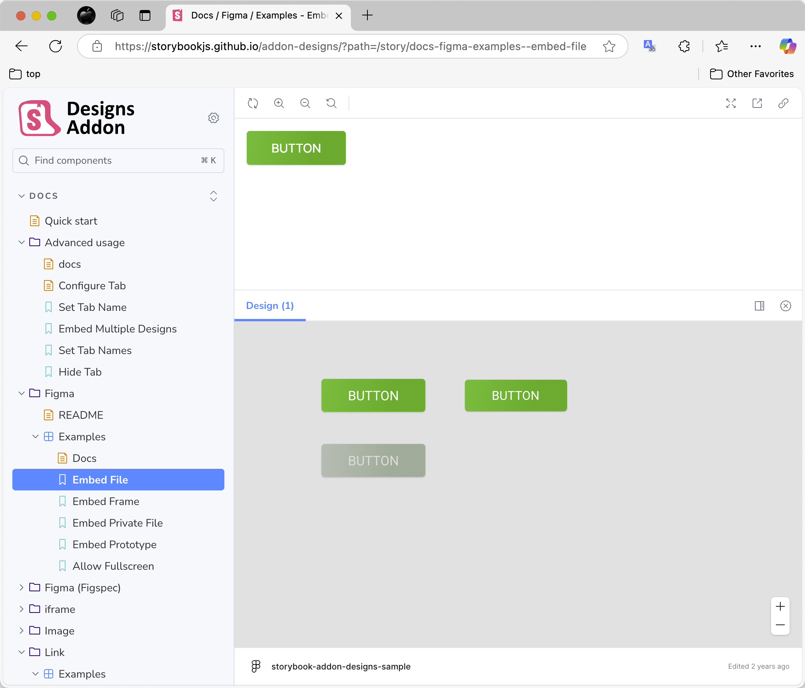
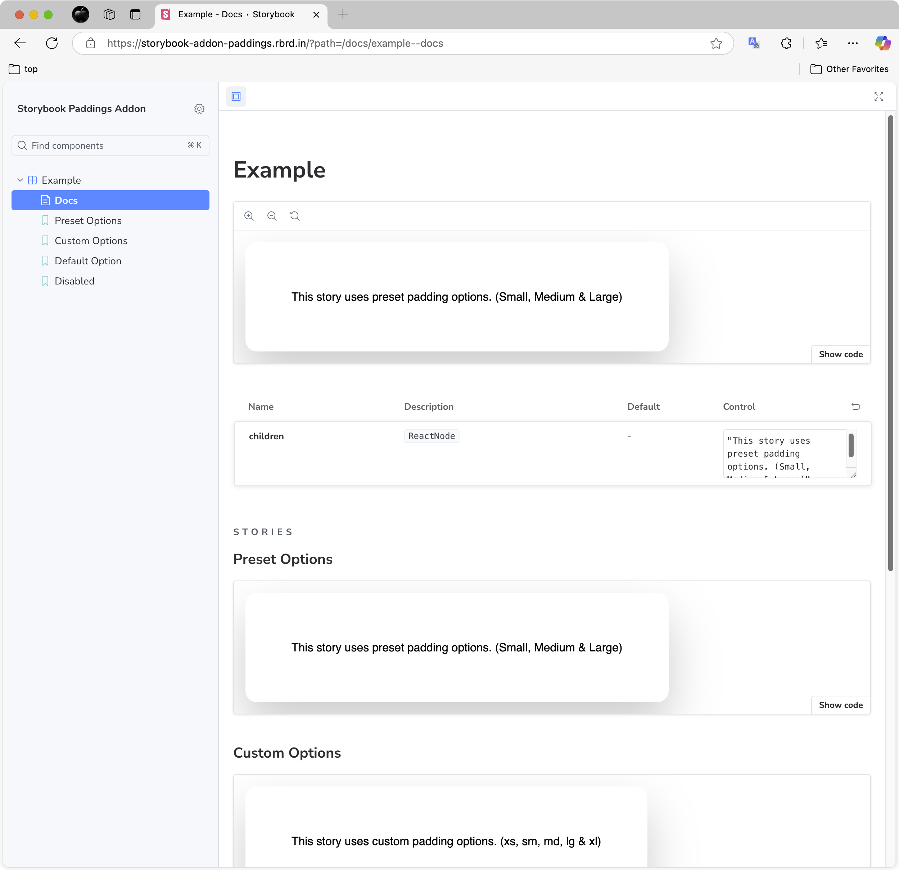

# storybook 介绍

`storybook` 工具主要提供:

1. 组件 UI 渲染能力，可以展示纯 UI 组件样式 (需要 storybook 运行环境，可能需要分离业务或者 mock 业务)
2. 支持文档，支持自动推断组件的属性，可以生成组件的文档 （通常是）
3. 和实际项目开发无关，可以独立更新和维护

还有更多插件提供更多功能。

**初步想法**

    storybook 添加到 example 中。
    尝试 添加 storybook 示例 文档和样式，同时，可以更加准确评估工作量、以及可能涉及的 uikit 改动。

## 竞品调研现状

国内厂商融云、网易、腾讯，国外 `sendbird`、`getstream`。

| 厂商        | uikit | 文档 | 组件库 | 组件库文档 | 组件库 UI 渲染 | 组件库文档自动生成 | 备注                    |
| ----------- | ----- | ---- | ------ | ---------- | -------------- | ------------------ | ----------------------- |
| 融云        | ❌    | ❌   | ❌     | ❌         | ❌             | ❌                 | 无 uikit 产品           |
| 网易        | ❌    | ❌   | ❌     | ❌         | ❌             | ❌                 | 无 uikit 产品           |
| 腾讯        | ✅    | ✅   | ✅     | ✅         | ❌             | ❌                 |                         |
| sendbird    | ✅    | ✅   | ✅     | ✅         | ❌             | ❌                 | sample 使用，但废弃状态 |
| getstream   | ✅    | ✅   | ✅     | ✅         | ❌             | ❌                 |                         |
| easemob web | ✅    | ✅   | ✅     | ✅         | ✅             | ✅                 | react 产品              |

    _使用符号_:
      > 已经实现: ✅
      > 未实现: ❌

## 体验 demo

通过 官网 `demo` 和 `web demo`，可以确认 `storybook` 渲染组件 和 文档说明 需要单独维护，相当于额外维护一套文档， 和当前文档相互独立。

### 官方 demo

更多展示如何创建 包含 storybook 的项目

### web demo

展示了文档说明和 UI 样式。

### storybook 插件 figma

介绍了如何将 figma 设计稿嵌入到 storybook 中，方便对比设计稿和开发稿。

### storybook 插件 padding

介绍了如何自定义 padding 样式。

## 当前 uikit

1. 在 dev 模型下，example 可以动态展示组件样式和使用方式。
2. 在 docs 文件夹下，维护 repo 级别的 文档，更新定义声明的类型时同步更新。

## 使用量统计

[官方 storybook 统计文档插件使用率:](https://github.com/storybookjs/storybook)

react 的 storybook 文档插件使用量是 react-native 30 倍左右。

## 版本兼容性

官方介绍:

storybook 最新版本 8.6.x，最低要求 react-native 0.72 版本。

实际:

react-native 0.72 版本适配 storybook 6.5.x 版本。

## references

[auto_docs](https://storybook.org.cn/docs/writing-docs/autodocs)
[rn_storybook](https://github.com/storybookjs/react-native?tab=readme-ov-file)
[storybook_github](https://github.com/storybookjs/storybook)
[rn_expo_storybook_example](https://github.com/dannyhw/expo-storybook-starter)
[rn_storybook_example](https://github.com/dannyhw/react-native-storybook-starter)
[rn_tencent_introduce](https://cloud.tencent.com/document/product/269/92670)

[storybook_with_figma](https://github.com/storybookjs/addon-designs/tree/master)
[storybook_with_padding](https://github.com/rbardini/storybook-addon-paddings)

## Resources

下载量 截图

figma 插件截图

padding 插件截图

