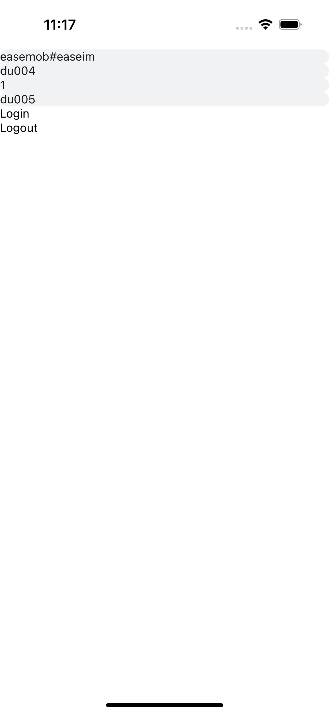
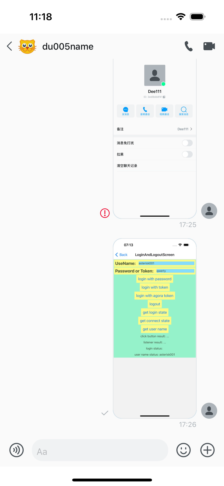

[Return to Parent Document](./index.en.md)

# Quick Start

## Goal: Send a message

Create an application, configure the project, fill in the necessary UIKit code, and implement message sending.

## Steps

### 1. Create a project

[Refer to the relevant chapter](./create-app.md)

**Note:** If you create a project using `expo`, you need to create the `native` related files. See the FAQ in the project creation instructions for more details.

### 2. Initialize the project

Run the command `yarn` to initialize the project.

Add the dependencies required by UIKit using the following command:

```sh
yarn add @react-native-async-storage/async-storage@^1.17.11 \
@react-native-camera-roll/camera-roll@^5.6.0 \
@react-native-clipboard/clipboard@^1.11.2 \
date-fns@^2.30.0 \
pinyin-pro@^3.18.3 \
pure-uuid@^1.6.3 \
react-native-agora@^4.2.6 \
react-native-chat-uikit@2.2.1 \
react-native-chat-sdk@1.5.1 \
react-native-audio-recorder-player@^3.5.3 \
@easemob/react-native-create-thumbnail@^1.6.6 \
react-native-device-info@^10.6.0 \
react-native-document-picker@^9.0.1 \
react-native-fast-image@^8.6.3 \
react-native-file-access@^3.0.4 \
react-native-gesture-handler@~2.9.0 \
react-native-get-random-values@~1.8.0 \
react-native-image-picker@^7.0.3 \
react-native-permissions@^3.8.0 \
react-native-safe-area-context@4.5.0 \
react-native-screens@^3.20.0 \
react-native-video@^5.2.1 \
react-native-web@~0.19.6 \
react-native-webview@13.2.2 \
twemoji@14.0.2
```

For the iOS platform:

Update the content in the `Info.plist` file to add the required permissions.

```xml
<dict>
	<key>NSCameraUsageDescription</key>
	<string></string>
	<key>NSMicrophoneUsageDescription</key>
	<string></string>
	<key>NSPhotoLibraryUsageDescription</key>
	<string></string>
</dict>
```

Install the dependencies required by iOS. Run the following command:

```sh
# Install iOS dependencies in the `ios` folder of the project directory
# Note: Projects created with expo do not have an ios folder. You need to create it using a command. See the `Project Creation Instructions` section for details.
pod install
```

For the Android Studio platform:

Update the content in the `AndroidManifest.xml` file to add the required permissions.

```xml
<manifest xmlns:android="http://schemas.android.com/apk/res/android">
    <uses-permission android:name="android.permission.INTERNET"/>
    <uses-permission android:name="android.permission.CAMERA" />
    <uses-permission android:name="android.permission.READ_EXTERNAL_STORAGE" />
    <uses-permission android:name="android.permission.WRITE_EXTERNAL_STORAGE" />
    <uses-permission android:name="android.permission.RECORD_AUDIO" />
</manifest>
```

Install the dependencies required by Android Studio. Open the Android project in Android Studio application and run sync automatically or manually.

### 3. Write the code

```tsx
/* eslint-disable react-native/no-inline-styles */
/**
 * Sample React Native App
 * https://github.com/facebook/react-native
 *
 * @format
 */

import * as React from 'react';
import { Pressable, SafeAreaView, Text, View } from 'react-native';
import {
  Container,
  ConversationDetail,
  TextInput,
  useChatContext,
} from 'react-native-chat-uikit';

const appKey = '<your app key>';
const userId = '<current login id>';
const userPassword = '<current login password or token>';
const usePassword = true; // or false;
const peerId = '<chat peer id>';

function SendMessage() {
  const [page, setPage] = React.useState(0);
  const [appkey, setAppkey] = React.useState(appKey);
  const [id, setId] = React.useState(userId);
  const [ps, setPs] = React.useState(userPassword);
  const [peer, setPeer] = React.useState(peerId);
  const im = useChatContext();

  if (page === 0) {
    return (
      // Login Page
      <SafeAreaView style={{ flex: 1 }}>
        <TextInput
          placeholder="Please enter App Key."
          value={appkey}
          onChangeText={setAppkey}
        />
        <TextInput
          placeholder="Please enter Login ID."
          value={id}
          onChangeText={setId}
        />
        <TextInput
          placeholder="Please enter Login token or password."
          value={ps}
          onChangeText={setPs}
        />
        <TextInput
          placeholder="Please enter peer ID."
          value={peer}
          onChangeText={setPeer}
        />
        <Pressable
          onPress={() => {
            console.log('test:zuoyu:login', id, ps);
            im.login({
              userId: id,
              userToken: ps,
              usePassword: usePassword,
              result: (res) => {
                console.log('login result', res);
                console.log('test:zuoyu:error', res);
                if (res.isOk === true) {
                  setPage(1);
                }
              },
            });
          }}
        >
          <Text>{'Login'}</Text>
        </Pressable>
        <Pressable
          onPress={() => {
            im.logout({
              result: () => {},
            });
          }}
        >
          <Text>{'Logout'}</Text>
        </Pressable>
      </SafeAreaView>
    );
  } else if (page === 1) {
    // Chat Page
    return (
      <SafeAreaView style={{ flex: 1 }}>
        <ConversationDetail
          convId={peer}
          convType={0}
          onBack={() => {
            setPage(0);
            im.logout({
              result: () => {},
            });
          }}
          type={'chat'}
        />
      </SafeAreaView>
    );
  } else {
    return <View />;
  }
}

function App(): React.JSX.Element {
  // Initialize UIKit
  return (
    <Container options={{ appKey: appKey, autoLogin: false }}>
      <SendMessage />
    </Container>
  );
}

export default App;
```

### 4. Build and compile

There are two methods for building and compilation: command-line compilation and native compilation. Command-line compilation is simpler but cannot identify some native issues. Native compilation is a bit more complicated, but can help identify the reasons for build failures in the project creation process. We recommend using the second method for the first time and the first method for subsequent use.

#### Command-line method

In the `package.json` configuration file, you can find the `scripts` node, which contains the commands. After creating a `react-native` project, it will automatically provide compilation and running commands.

To run the iOS application, run the `yarn run ios` command in the terminal.
To run the Android application, run the `yarn run android` command in the terminal.

#### Native method

In the `package.json` configuration file, you can find the `scripts` node, which contains the commands.

Run the development service command `yarn run start`.

For iOS applications, open the `.xcworkspace` project file in the `ios` folder on Xcode, and compile and run it. For more information on Xcode operations, please refer to the official website.
For Android applications, open the project in the `android` folder in Android Studio, and run sync automatically. If the synchronization fails, check the error message; otherwise, complete project initialization and then compile and run it.

### 5. Send a message

Before running, write the necessary preset parameters:

```tsx
const appKey = '<your app key>';
const userId = '<current login id>';
const userPassword = '<current login password or token>';
const usePassword = true; // or false;
const peerId = '<chat peer id>';
```

**If you modify the appKey, you need to restart the application for the changes to take effect.**

After running, click **Login** to open the chat page, enter the text content, and click **Send** to send a message to the recipient.

<!-- 
 -->

For the welcome page, click **Login** to log in.


For the chat page, click **Send** to send a message.


## More

For other issues, you can refer to [Q&A](./qa.en.md).

## Complete Source Code Repository

[Click here to view the source code](https://github.com/AsteriskZuo/TestRNUIKIT/tree/2.1).
